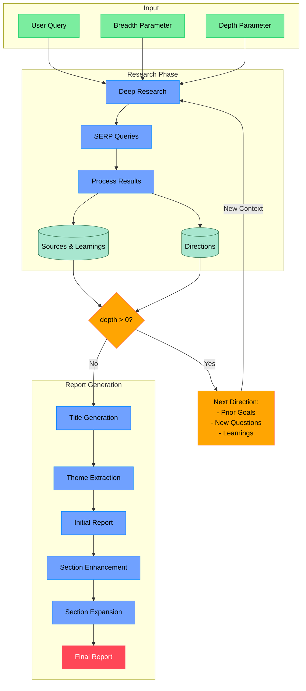

# Shandu 2.0: Advanced AI Research System with Robust Report Generation

Shandu is a cutting-edge AI research assistant that performs in-depth, multi-source research on any topic using advanced language models, intelligent web scraping, and iterative exploration to generate comprehensive, well-structured reports with proper citations.

[](LICENSE)
[](https://www.python.org/downloads/)

## 🔍 What is Shandu?

Shandu is an intelligent, LLM-powered research system that automates the comprehensive research process - from initial query clarification to in-depth content analysis and report generation. Built on LangGraph's state-based workflow, it recursively explores topics with sophisticated algorithms for source evaluation, content extraction, and knowledge synthesis.

### Key Use Cases

- **Academic Research**: Generate literature reviews, background information, and complex topic analyses
- **Market Intelligence**: Analyze industry trends, competitor strategies, and market opportunities
- **Content Creation**: Produce well-researched articles, blog posts, and reports with proper citations
- **Technology Exploration**: Track emerging technologies, innovations, and technical developments
- **Policy Analysis**: Research regulations, compliance requirements, and policy implications
- **Competitive Analysis**: Compare products, services, and company strategies across industries

## 🚀 What's New in Version 2.0

Shandu 2.0 introduces a major redesign of the report generation pipeline to produce more coherent, reliable reports:

- **Modular Report Generation**: Process reports in self-contained sections, enhancing overall system reliability
- **Robust Error Recovery**: Automatic retry mechanisms with intelligent fallbacks prevent the system from getting stuck
- **Section-By-Section Processing**: Each section is processed independently, allowing for better error isolation
- **Progress Tracking**: Detailed progress tracking helps identify exactly where the process is at each stage
- **Enhanced Citation Management**: More reliable citation handling ensures proper attribution throughout reports
- **Intelligent Parallelization**: Key processes run in parallel where possible for improved performance
- **Comprehensive Fallback Mechanisms**: If any step fails, the system gracefully degrades rather than halting

## ⚙️ How Shandu Works



## 🌟 Key Features

- **Intelligent State-based Workflow**: Leverages LangGraph for a structured, step-by-step research process
- **Iterative Deep Exploration**: Recursively explores topics with dynamic depth and breadth parameters
- **Multi-source Information Synthesis**: Analyzes data from search engines, web content, and knowledge bases
- **Enhanced Web Scraping**: Features dynamic JS rendering, content extraction, and ethical scraping practices
- **Smart Source Evaluation**: Automatically assesses source credibility, relevance, and information value
- **Content Analysis Pipeline**: Uses advanced NLP to extract key information, identify patterns, and synthesize findings
- **Sectional Report Generation**: Creates detailed reports by processing individual sections for maximum reliability
- **Parallel Processing Architecture**: Implements concurrent operations for efficient multi-query execution
- **Adaptive Search Strategy**: Dynamically adjusts search queries based on discovered information
- **Full Citation Management**: Properly attributes all sources with formatted citations in multiple styles
- **Local Knowledge Base**: Integrate your personal documents (PDF, DOCX, TXT) into the research process for context-aware insights.

## 🧠 Local Knowledge Base

Shandu can now build and leverage a local knowledge base from your own documents, allowing research to be augmented with your private information. This means search results and analysis can include insights from both the web and your curated local files.

**Key Local KB Features:**

*   **Persistent Knowledge Base**: Store, manage, and index your documents (PDF, DOCX, TXT) over time. Your personal library becomes a searchable asset.
*   **Local Semantic Search**: Documents are indexed using a local sentence transformer model (`all-MiniLM-L6-v2` by default) enabling fast and relevant semantic search within your files.
*   **Mixed Results & Analysis**: The research process seamlessly combines web findings with relevant information extracted from your local documents, providing a richer, more contextualized output.
*   **Supported File Types**: Currently supports `.pdf`, `.docx`, and `.txt` files.
*   **Session-Specific Context**: Optionally, include local files for a single research task without adding them to your persistent knowledge base.

### Managing Your Persistent Knowledge Base

Your persistent Local Knowledge Base (KB) stores documents you want Shandu to remember across research sessions. The location of this KB is defined in your Shandu configuration (typically `~/.shandu/config.json`) under the `local_kb.kb_dir` key, defaulting to `local_kb_data` in your Shandu configuration directory.

You can manage this persistent KB using the following CLI commands:

*   **Add a document:**
    ```bash
    shandu kb add <file_path> [--source_type <type>] [--content_type <type>] [--metadata_json <json_string>]
    ```
    -   `<file_path>`: Path to the document (PDF, DOCX, TXT).
    -   `--source_type` (optional): Specify the source type (e.g., "personal_notes", "research_paper"). Defaults to "local_file".
    -   `--content_type` (optional): Specify the content type (e.g., "article", "report"). Guessed if not provided.
    -   `--metadata_json` (optional): A JSON string for additional metadata (e.g., `'{"author": "John Doe", "tags": ["important"]}'`).
    *   Example:
        ```bash
        shandu kb add ./my_research_paper.pdf --content_type "academic paper" --metadata_json '{"project": "Alpha"}'
        ```

*   **Remove a document:**
    ```bash
    shandu kb remove <file_path>
    ```
    -   `<file_path>`: Path to the document to remove from the KB.
    *   Example:
        ```bash
        shandu kb remove ./my_research_paper.pdf
        ```

*   **List documents:**
    ```bash
    shandu kb list
    ```
    -   Displays a table of all documents currently in your persistent KB, including their title, path, type, and number of indexed chunks.
    *   Example output:
        ```
        ────────────────── Local KB Documents ───────────────────
        | # | Title                | Path                           | Type   | Indexed Chunks |
        |---|----------------------|--------------------------------|--------|----------------|
        | 1 | my_research_paper.pdf| /path/to/my_research_paper.pdf | .pdf   | 42             |
        | 2 | project_notes.docx   | /path/to/project_notes.docx    | .docx  | 15             |
        ─────────────────────────────────────────────────────────
        ```

*   **Re-index all documents:**
    ```bash
    shandu kb reindex
    ```
    -   This command re-processes all documents currently in your persistent KB and rebuilds the search index. This can be useful if the underlying embedding model or indexing logic changes, or if you suspect the index is out of sync.

### Using Local Files for a Single Research Task

If you want to include local documents for a specific research session without adding them to your persistent KB, you can use the `--local-files` (or `-lf`) option with the `research` command.

```bash
shandu research "Your research query" --local-files <file1_path>,<file2_path>,...
```
*   `<file1_path>,<file2_path>,...`: A comma-separated list of paths to local documents.
*   Example:
    ```bash
    shandu research "Benefits of renewable energy" --local-files ./solar_report.pdf,./notes/wind_energy_notes.docx
    ```
*   **How it works**: When you use `--local-files`, Shandu creates a temporary, isolated knowledge base for that specific research session. The provided files are parsed, indexed, and used only for that run. This temporary KB is automatically cleaned up after the research is complete and does not affect your persistent KB.

## 🏁 Quick Start

```bash
# Install from PyPI
pip install shandu

# Install from source
git clone https://github.com/jolovicdev/shandu.git
cd shandu
pip install -e . # This installs dependencies from requirements.txt

# Dependencies for Local KB:
# If you plan to use the Local Knowledge Base, ensure you have the necessary extras.
# While `pip install -e .` should cover it, you can also install them directly:
# pip install pypdf2 python-docx sentence-transformers faiss-cpu

# Configure API settings (supports various LLM providers)
shandu configure

# Run comprehensive research
shandu research "Your research query" --depth 2 --breadth 4 --output report.md

# Research with local files for a single session
shandu research "Impact of AI on healthcare" -lf ./my_ai_paper.pdf,./health_regulations.docx

# Manage your persistent Local Knowledge Base
shandu kb add ./important_doc.txt
shandu kb list

# Quick AI-powered search with web scraping
shandu aisearch "Who is the current sitting president of United States?" --detailed
```

## 📚 Detailed Usage

### Research Command

```bash
shandu research "Your research query" \
    --depth 3 \                  # How deep to explore (1-5, default: 2)
    --breadth 5 \                # How many parallel queries (2-10, default: 4)
    --output report.md \         # Save to file instead of terminal
    --verbose \                  # Show detailed progress
    --local-files ./file1.pdf,./docs/file2.txt # Include local files for this session
```

### Local Knowledge Base Commands

Access KB management via `shandu kb --help`. Key commands include:
- `shandu kb add <path_to_file>`: Adds a document.
- `shandu kb remove <path_to_file>`: Removes a document.
- `shandu kb list`: Lists all documents.
- `shandu kb reindex`: Rebuilds the search index.

Refer to the "Local Knowledge Base" section above for more details.

### Example Reports

You can find example reports in the examples directory:

1. **The Intersection of Quantum Computing, Synthetic Biology, and Climate Modeling**
   ```bash
   shandu research "The Intersection of Quantum Computing, Synthetic Biology, and Climate Modeling" --depth 3 --breadth 3 --output examples/o3-mini-high.md
   ```

## 💻 Python API

```python
from shandu.agents import ResearchGraph
from langchain_openai import ChatOpenAI

# Initialize with custom LLM if desired
llm = ChatOpenAI(model="gpt-4")

# Initialize the research graph
researcher = ResearchGraph(
    llm=llm,
    temperature=0.5
)

# Perform deep research
results = researcher.research_sync(
    query="Your research query",
    depth=3,       # How deep to go with recursive research
    breadth=4,     # How many parallel queries to explore
    detail_level="high"
)

# Print or save results
print(results.to_markdown())

# Note on LocalKB with Python API:
# The LocalKB is primarily managed via CLI and used by the research process
# through global configuration. Direct Python API for LocalKB manipulation exists
# (`from shandu.local_kb import LocalKB`) but is more advanced usage.
# The research command will automatically pick up the configured persistent LocalKB
# or a session-specific one if --local-files is used with the CLI.
```

## ⚙️ Configuration

Shandu's configuration is typically managed via `shandu configure` or by editing the JSON file at `~/.shandu/config.json`. Key settings include:

*   **API Settings** (`api` section): `base_url`, `api_key`, `model`.
*   **Search Settings** (`search` section): `engines`, `max_results`, `user_agent`.
*   **Research Parameters** (`research` section): `default_depth`, `default_breadth`, `max_urls_per_query`.
*   **Local Knowledge Base Settings** (`local_kb` section):
    *   `enabled`: `true` or `false`. Whether to use the Local KB feature during research.
    *   `kb_dir`: Path to store persistent Local KB data (default: `~/.shandu/local_kb_data`).
    *   `max_results_per_query`: How many relevant chunks to retrieve from Local KB per query (default: 3).
    *   `embedding_model_path`: (Currently not user-configurable via `config.json`, uses a default path for `all-MiniLM-L6-v2`). For optimal performance, ensure this model is available locally. Shandu will attempt to use it from a default location.

## 🧩 Advanced Architecture

### Research Pipeline

Shandu's research pipeline consists of these key stages:

1. **Query Clarification**: Interactive questions to understand research needs
2. **Research Planning**: Strategic planning for comprehensive topic coverage
3. **Iterative Exploration**:
   - Smart query generation based on knowledge gaps
   - Multi-engine search with parallelized execution
   - Relevance filtering of search results
   - Intelligent web scraping with content extraction
   - Source credibility assessment
   - Information analysis and synthesis
   - Reflection on findings to identify gaps

### Report Generation Pipeline

Shandu 2.0 introduces a robust, modular report generation pipeline:

1. **Data Preparation**: Registration of all sources and their metadata for proper citation
2. **Title Generation**: Creating a concise, professional title (with retry mechanisms)
3. **Theme Extraction**: Identifying key themes to organize the report structure
4. **Citation Formatting**: Properly formatting all citations for reference
5. **Initial Report Generation**: Creating a comprehensive draft report
6. **Section Enhancement**: Individually processing each section to add detail and depth
7. **Key Section Expansion**: Identifying and expanding the most important sections
8. **Report Finalization**: Final processing and validation of the complete report

Each step includes:
- Comprehensive error handling
- Automatic retries with exponential backoff
- Intelligent fallbacks when issues occur
- Progress tracking for transparency
- Validation to ensure quality output

## 🔌 Supported Search Engines & Sources

- Google Search
- DuckDuckGo
- Wikipedia
- ArXiv (academic papers)
- Custom search engines can be added

## 📊 Technical Capabilities

- **Dynamic JS Rendering**: Handles JavaScript-heavy websites
- **Content Extraction**: Identifies and extracts main content from web pages
- **Parallel Processing**: Concurrent execution of searches and scraping
- **Caching**: Efficient caching of search results and scraped content
- **Rate Limiting**: Respectful access to web resources
- **Robots.txt Compliance**: Ethical web scraping practices
- **Flexible Output Formats**: Markdown, JSON, plain text

## 📜 License

This project is licensed under the MIT License - see the [LICENSE](LICENSE) file for details.
